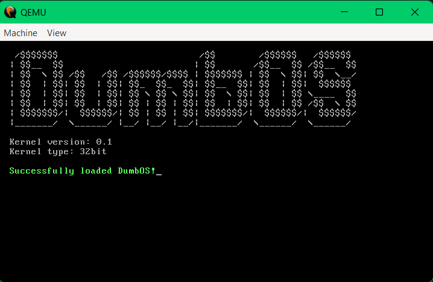

# DumbOS

This is a dumb idea i had to try to make an OS, obviously never anywhere near like a proper Unix or Windows, but just something that displays a lightweight GUI, has a barebones file manager and very lightweight graphics.

This OS is intended to be ran through Windows 10/11 with MSys2 and Qemu at the current stage.

## How to install and set up Msys2 and Qemu for running DumbOS

- [Download Msys2](https://www.msys2.org/)
- Launch 'Msys2 MinGW64'
- Set up Msys2       - 'pacman -Syu'
- Install essentials - 'pacman -S --needed base-devel nasm cmake'
- Install Qemu       - 'pacman -S mingw-w64-x86_64-qemu'
	
---

## How to run

- Launch 'Msys2 MinGW64'
- Navigate to 'boot.bin' (example: cd /c/Users/greenlaser/Documents/_dumb/DumbOS/build)
- Run DumbOS 'qemu-system-x86_64.exe -drive format=raw,file=boot.bin'

---

## How to compile

- Launch 'Msys2 MinGW64'
- Navigate to project root (example: cd /c/Users/greenlaser/Documents/_dumb/DumbOS)
- Run the shell build script - 'bash build.sh'